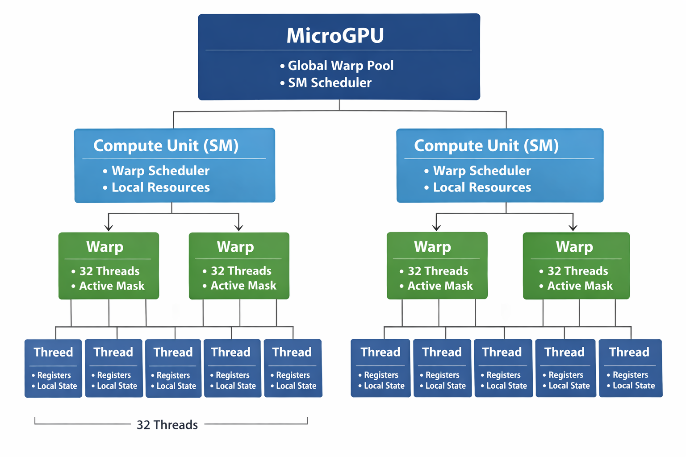

 MicroGPU

 I am creating a simple functional model of GPU to understand its architecture. I have started with class definition of thread and warp and later added compute units.

 Currently, microGPU is able to accept warps in global collection and then schedule to computeUnits. 

 TODO:
 Create functionality in compute unit to process the warps and mark it complete and remove it from its own warp collection.

 I will be adding more functionality and update this README.

Current status (02/08):
The test is able to create warp and assign to Compute Units. Compute unit is able to execute warp in round robin manner. It has been verified from log file by looking at the pipeline stage with time.

 ## GPU Execution Hierarchy

  

